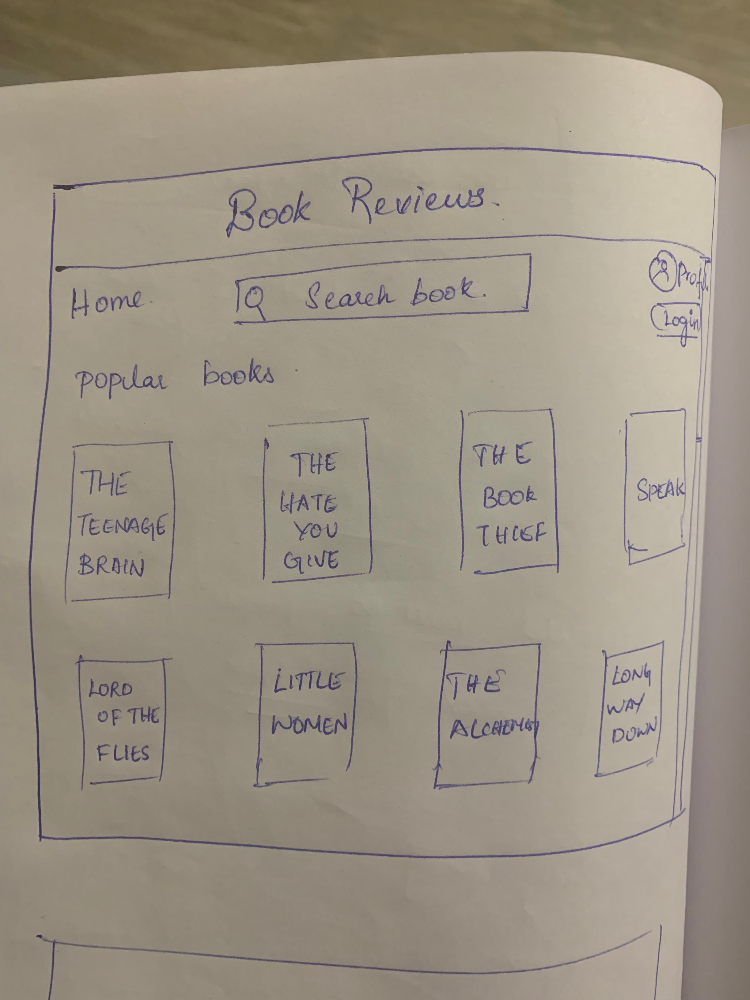
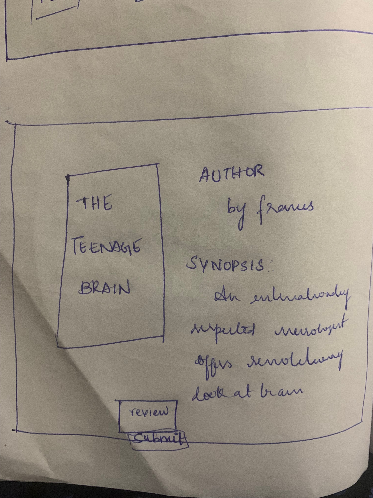
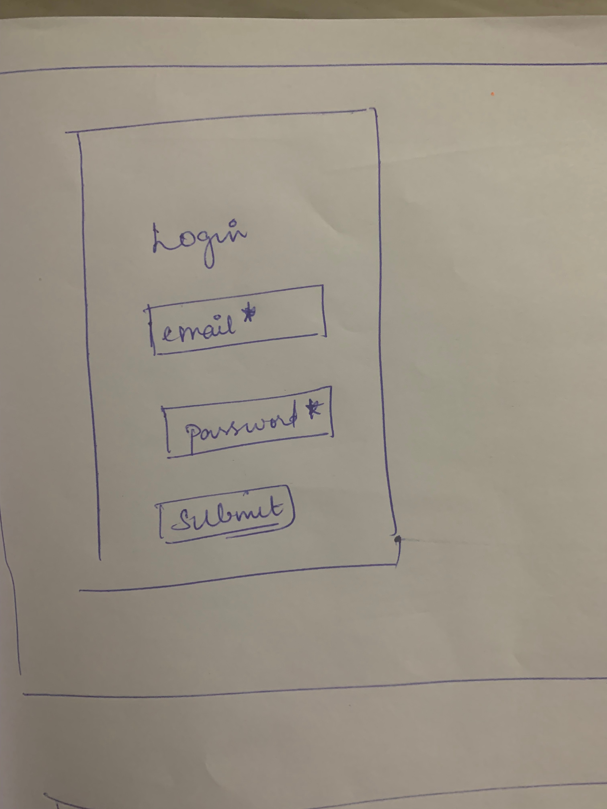
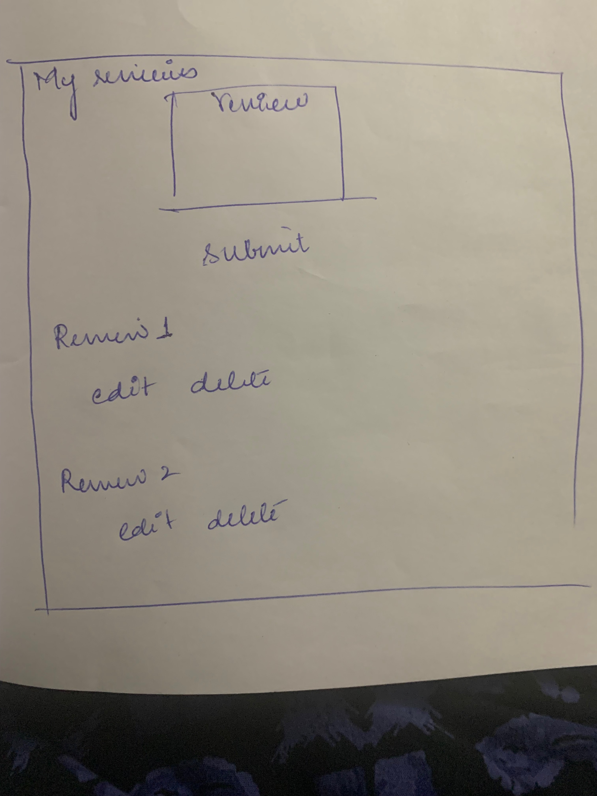
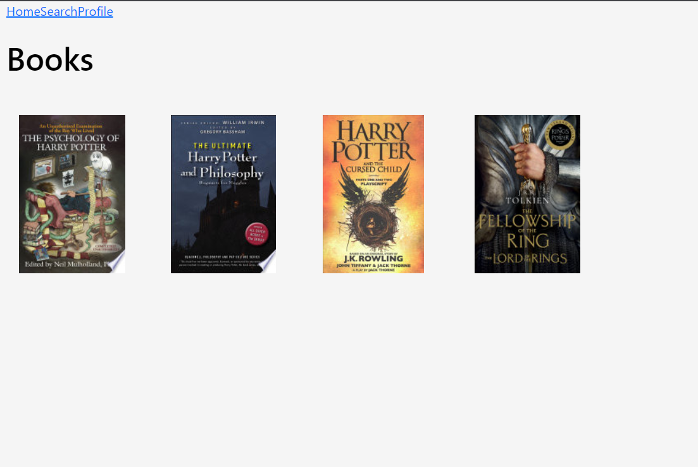
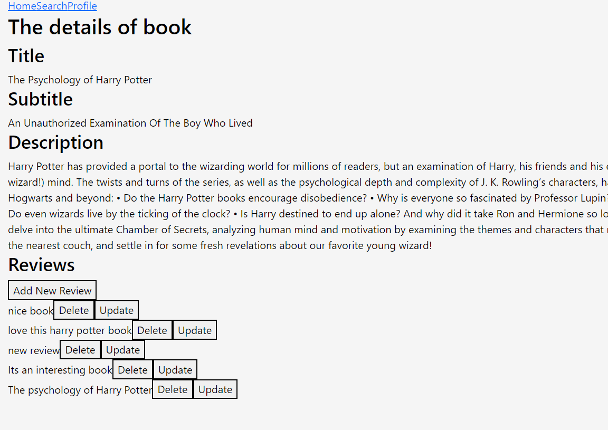

# Group Project - Book Review , (Canvas - BookReview)
---
## Overview.
As we are all aware, the skill of reading books has diminished compared to before. The goal of this project to emphasise the book reviews and create an awareness on how books have created powerfull impact into their life.

---
## Deployed Site
https://project-3-frontend.onrender.com/
(might take some time to render first time , as onrender deactivates not frequently used site)

---
## Member Contribution
* Karishma:
  * Creating the backend with routes and controls for books
  * Adding the Details, Update, and Delete functionality for reviews on frontend

* Venkateswari:
  * Hooking the backend and frontend
  * Adding the Add reviews functionality on frontend

* Vrushal:
  * Adding the reviews routes and controls on backend for insert update and delete
  * Creating the frontend and adding the Home page on the frontend to display the list of the books.

---
## Target Audience.
The proportion of children who are daily readers drops markedly from childhood to the teen and teenage years. Used wisely, technology such as ereaders could help support ongoing efforts to reduce disparities, promote reading achievement, and fuel a passion for reading among all young people.
The **teenagers** are the target audience.

**User Needs**
* Easy Access to Books
* Simple website
* Motivating factor

**User Painpoints**
* Discouraged by boring old websites
* complex systems to search for book

**Addressed Issues**
* Making it easy to search for books
* Making website encouraging to read books

**Competitors**
* https://www.booklistonline.com/
* https://www.librarything.com/
---
## Improvements over competitors
* Option to get book result on library website. We will be forwarding user to library website to see if this book is available there by searching book title on library website for them
* Motivate Teenagers to read books
---
## Design. 

---
## Frontend screenshots.

---
## Assumptions. 
* User has basic knowledge of web surfing

---
## Limitations. 
* Currentlty only support libraries near lower mainland area
---

