# Group Project - Book Review , (Canvas - BookReview)
---
## Overview.
As we are all aware, the skill of reading books has diminished compared to before. The goal of this project to emphasise the book reviews and create an awareness on how books have created powerfull impact into their life.

---
## Deployed Site
https://project-3-frontend.onrender.com/
(might take some time to render first time , as onrender deactivates not frequently used site)

---
## Youtube demo link
https://youtu.be/6VzNGeSZJS0

---
## Member Contribution (Iteration 1)

* Karishma:
  * Creating the backend with routes and controls for books
  * Adding the Details, Update, and Delete functionality for reviews on frontend

* Venkateswari:
  * Hooking the backend and frontend
  * Adding the Add reviews functionality on frontend

* Vrushal:
  * Adding the reviews routes and controls on backend for insert update and delete
  * Creating the frontend and adding the Home page on the frontend to display the list of the books.

---
## Member Contribution (Iteration 2)

* Karishma:
  * Creating the backend with routes and controls for profile and adding it to local DB.
  * Showing profile details on frontend and editing the profile details.

* Venkateswari:
  * Creating external api in Auth0 and calling secured api from frontend.
  * User authorization in the backend.

* Vrushal:
  * Adding login and logout to the frontend.
  * Displaying dynamic content when the user is logged in.

---
## Member Contribution (Iteration 3)

* Karishma:
  * Formatting the book details page to show all the reviews and make the reviews editable for the logged user and adding borrow book functionality.
  * Fixing some bugs and cleaning the code to remove unnecessary debug statements.

* Venkateswari:
  * Formatting the Book Details of Searched book item.
  * Added the borrow book functionality by forwarding user to VPL website.

* Vrushal:
  * Implemented search book functionality by using google books api.
  * Mapped reviews to particular user in backend and made possible for only review owner user to edit or delete particular review.

---
## Target Audience.
The proportion of children who are daily readers drops markedly from childhood to the teen and teenage years. Used wisely, technology such as ereaders could help support ongoing efforts to reduce disparities, promote reading achievement, and fuel a passion for reading among all young people.
The **teenagers** are the target audience.

**User Needs**
* Easy Access to Books
* Simple website
* Motivating factor

**User Painpoints**
* Discouraged by boring old websites
* complex systems to search for book

**Addressed Issues**
* Making it easy to search for books
* Making website encouraging to read books

**Competitors**
* https://www.booklistonline.com/
* https://www.librarything.com/
---
## Improvements over competitors
* Option to get book result on library website. We will be forwarding user to library website to see if this book is available there by searching book title on library website for them
* Motivate Teenagers to read books
---
## Design. 

---
## Frontend screenshots. (Iteration 1)

---
## Frontend screenshots. (Iteration 2)

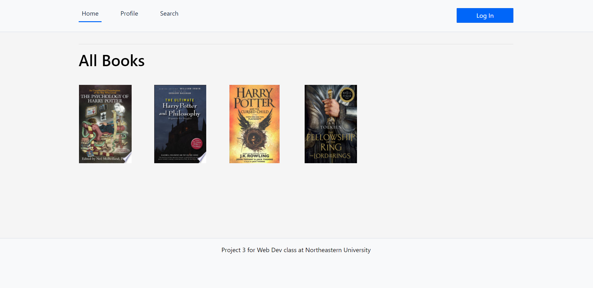
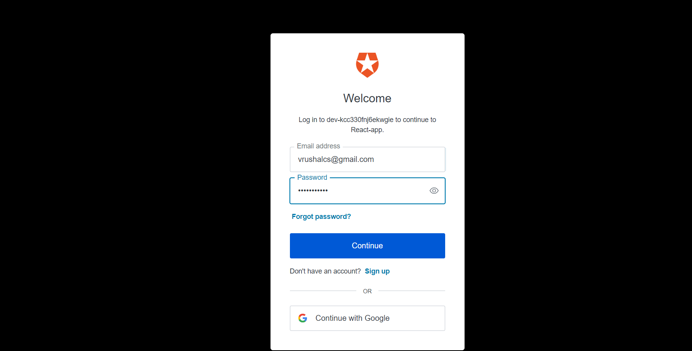
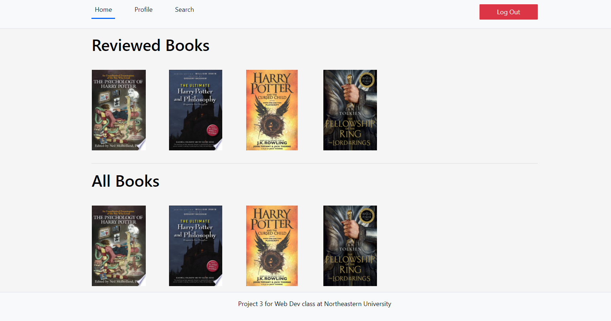
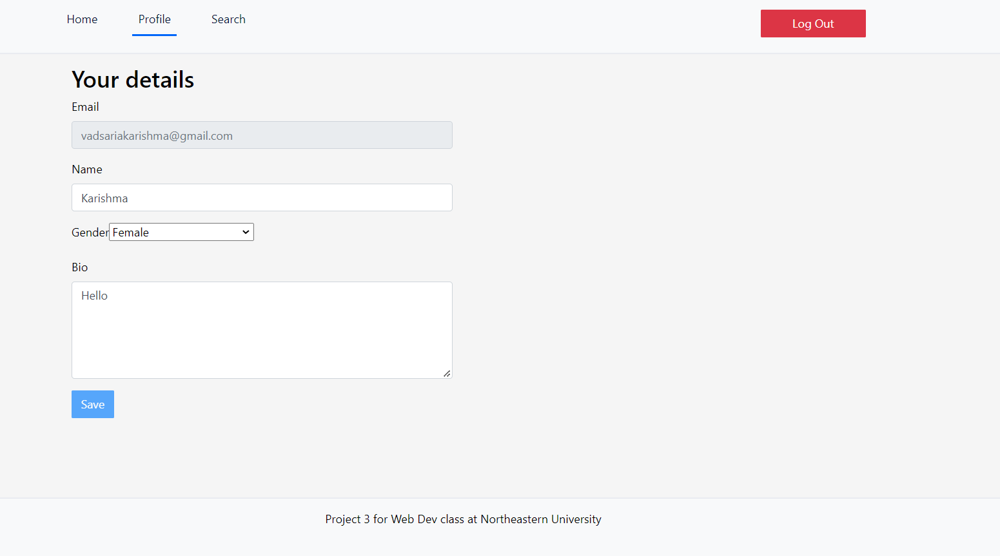
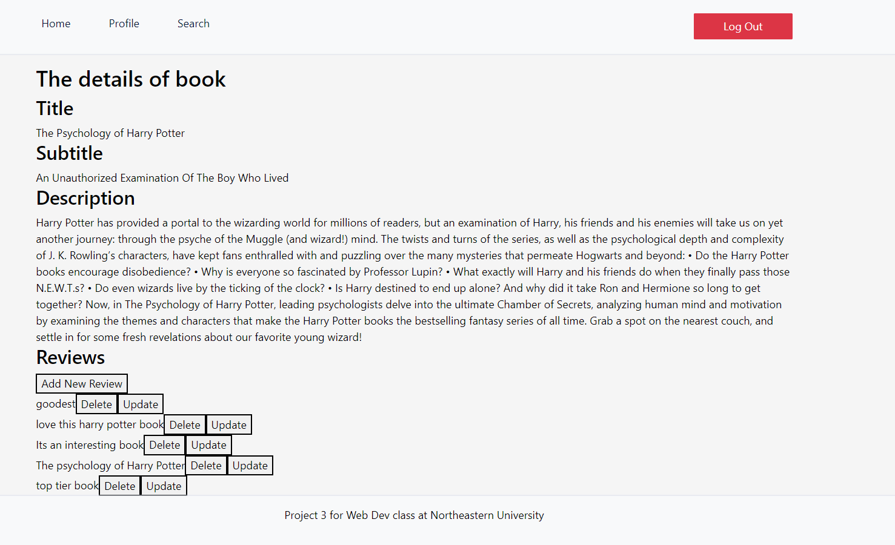

---
## Frontend screenshots. (Iteration 3)

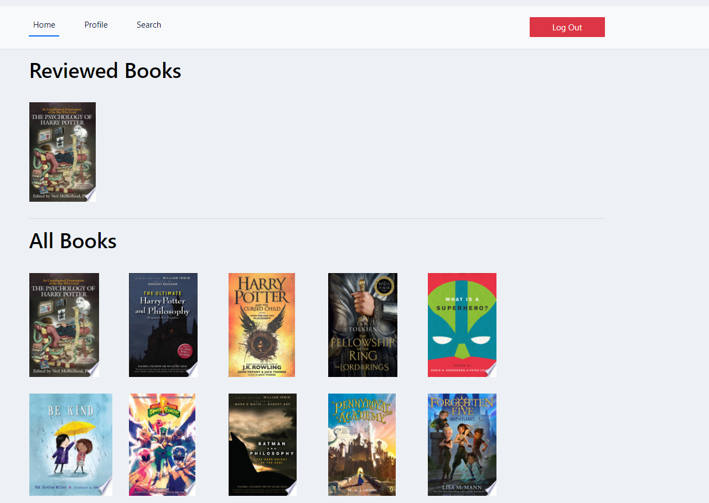
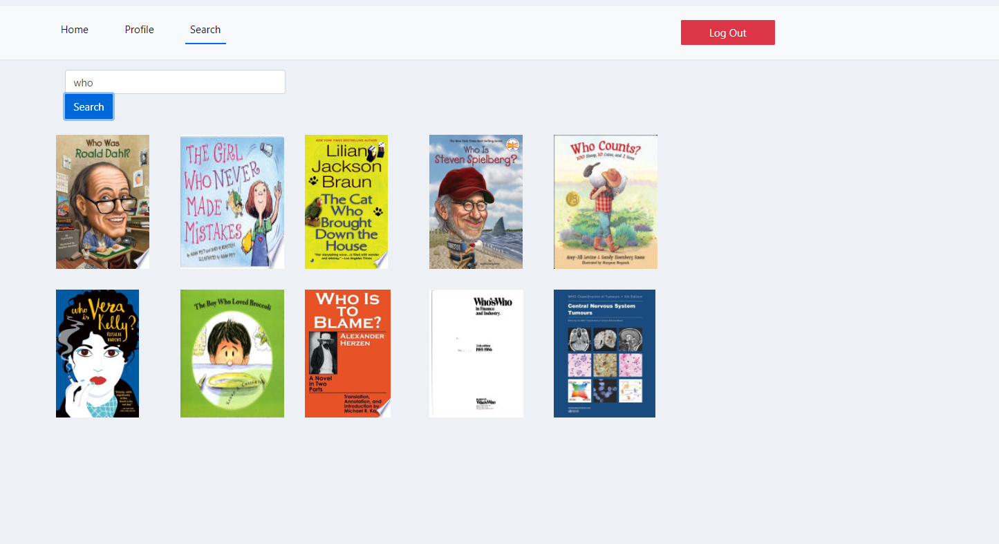
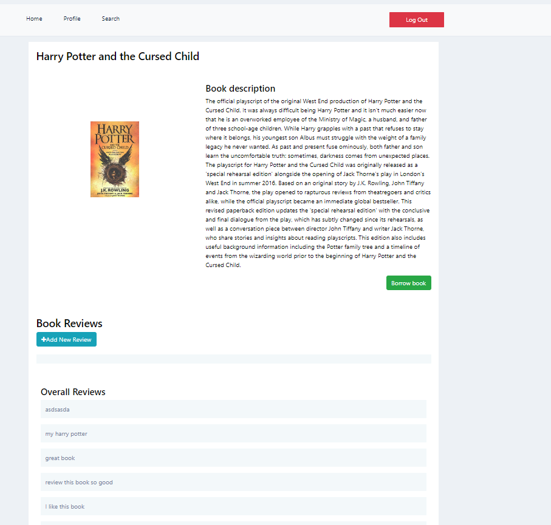
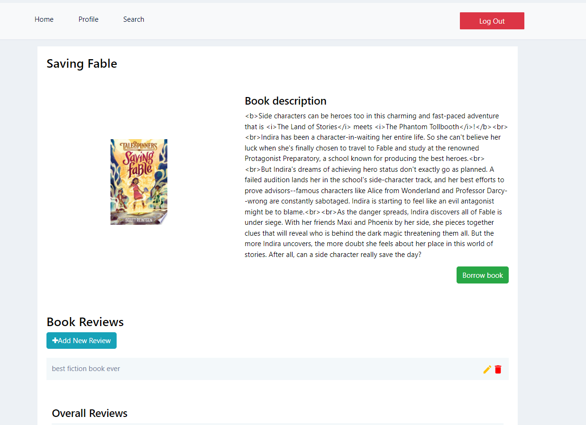
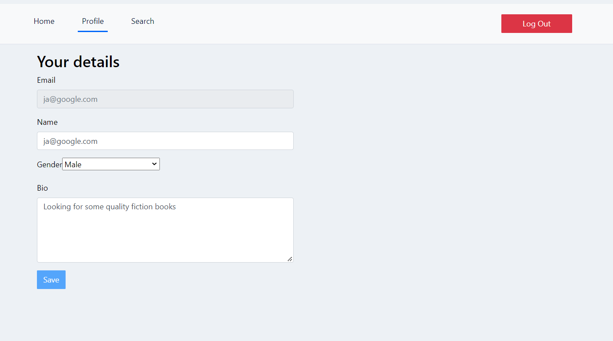

---
## Accessibility reports

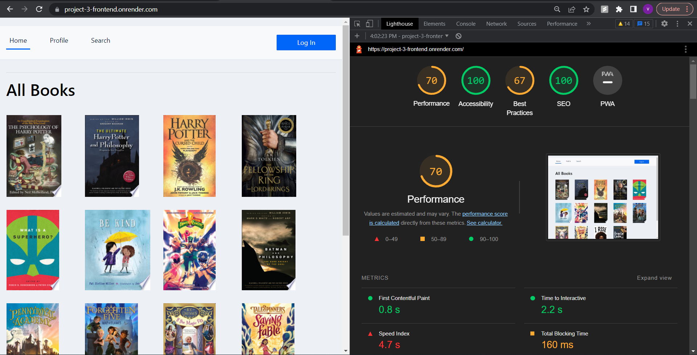
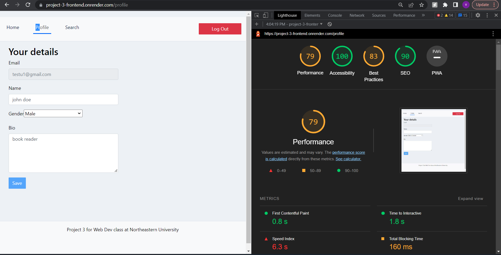
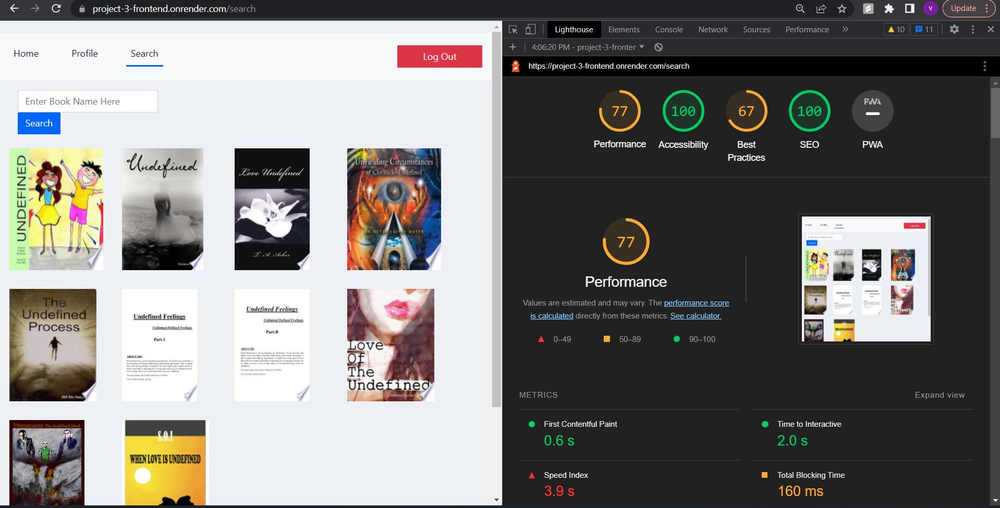
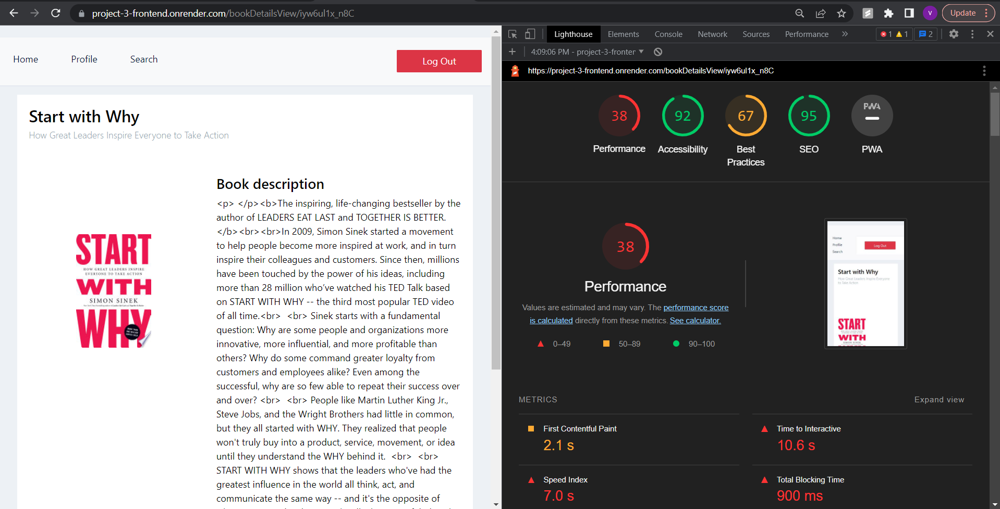
Accessibility is 92 due to issue with React Bootstrap button
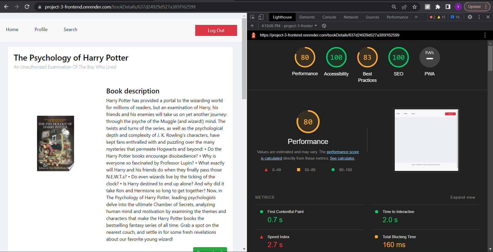

---
## Assumptions. 
* User has basic knowledge of web surfing

---
## Limitations. 
* Currentlty only support libraries near lower mainland area
---

